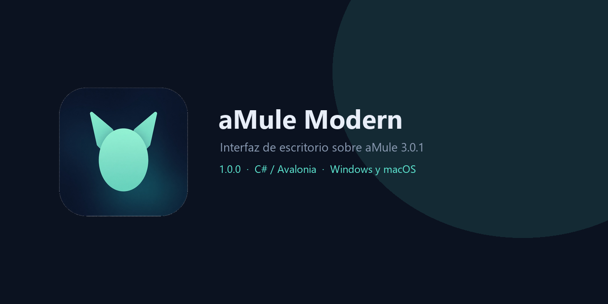

<p align="center">
  
</p>

<p align="center">
  
  
  
  
  
  
  
</p>

# aMule Modern

Interfaz de escritorio en C# / Avalonia, con aMule 3.0.1 como proceso independiente y control directo mediante EC. Es la misma aplicación en Windows y en macOS: en Mac el motor es el `amuled` oficial del DMG universal2, no el ejecutable de Windows.

**No es la versión 1.0.** Estado actual: **0.9.2-dev** — usable a diario (una ventana, tema claro/oscuro, pestañas de búsqueda, importar servidores, ZIP portable e instalador por usuario). La X oculta a la bandeja; «Salir y detener» cierra aMule y guarda la lista de servidores.

## Qué hace hoy

- **Descargas:** pegar un enlace `ed2k://`, ver la cola real, filtrar, seleccionar varias filas, pausar, reanudar, cancelar incompletas (borra temporales) y quitar completados de la lista (conserva el archivo).
- **Servidores:** añadir IPv4 o dominio y puerto, quitar, importar desde archivo (texto o `server.met`) o URL http/https, conectar y desconectar. Muestra estado eD2k y HighID/LowID. Importar no activa la descarga automática de listas al arrancar.
- **Buscar:** una búsqueda activa en el servidor actual, global eD2k o Kad; cada búsqueda se guarda en una pestaña para volver a ella. Resultados con fuentes, filtro, selección múltiple y descarga a la cola.
- **Ajustes:** Incoming, tmp, límites de bajada/subida (KiB/s, 0 = ilimitado) y Kad. Por defecto la biblioteca está en Descargas (`amule-modern/incoming` y `tmp`): `%USERPROFILE%\Downloads` en Windows y `~/Downloads` en macOS. Activar Kad no abre el cortafuegos. Si la subida es muy baja, aMule puede recortar la bajada.
- **Compartidos:** lista lo que el motor ofrece. Incoming se comparte solo; puedes añadir o quitar carpetas extra.

eD2k se habilita al arrancar, sin autoconexión. Hay que añadir un servidor y conectar a mano. Kad empieza desactivado.

## Cerrar y lista de servidores

Usa **Salir y detener** (barra lateral o menú de la bandeja). La X solo oculta a la bandeja; un cierre forzado del proceso **no escribe** `server.met` y la lista desaparece al volver a abrir.

Al entrar en Servidores, si la tabla está vacía: **Ejemplo → Importar URL** (`https://upd.emule-security.org/server.met`). La importación guarda nombres del `server.met`. Conectar es un paso aparte: selecciona un servidor y pulsa Conectar.

Hay dos perfiles distintos si mezclas el exe del repo y el instalado:

- Instalación: `%LOCALAPPDATA%\AmuleModern\.local\desktop`
- Checkout: `.local\desktop` del repositorio

Usa un solo acceso (el del Escritorio o Inicio). No lances dos `amuled` a la vez.

## Qué falta para 1.0

Esto es **0.9.2-dev**: sirve para el uso diario (buscar, descargar, servidores, compartidos, bandeja, instalador), no es un 1.0.

**Debe estar antes de llamar 1.0**

- Panel de detalle de cada descarga (ruta, hash, fuentes).
- Asociación opcional y reversible de `ed2k://`.
- Guardar columnas (ancho, orden, visibilidad) y densidad de filas.
- Cierre siempre ordenado, de modo que la lista de servidores y la cola no dependan de no matar el proceso.
- Sesión larga (8–24 h) y suspensión/reanudación de Windows sin corromper la cola.

**Debería estar**

- Categorías de descargas.
- Inicio con Windows, desactivado por defecto.
- Prueba formal de checksum de una descarga real (ya se ha completado una a mano).
- Instalador firmado (si no, SmartScreen avisará).

**Puede esperar**

- Windows 10 y ARM64 validados; Linux. macOS arm64 ya arranca (ver abajo); falta notarización y un instalador firmado.
- Varias búsquedas activas a la vez en el motor (hoy: una viva + pestañas instantánea).
- Motor remoto, plugins, migración de parciales desde eMule/aMule antiguo.

El plan completo está en [docs/PLAN.md](docs/PLAN.md). El estado ejecutado, en [docs/STATUS.md](docs/STATUS.md).

## Arrancar

Doble clic en `Iniciar.cmd`. Para preparar otro checkout desde PowerShell:

```powershell
.\scripts\Setup.ps1
.\scripts\Build.ps1 -Test -Publish
.\scripts\Start.ps1
```

El SDK se instala en `.tools`, sin cambiar el SDK global. `scripts/Build.ps1 -Publish` deja la app en `artifacts/app` (sigue usando el motor de `vendor` del repo). Paquete autónomo:

```powershell
.\scripts\Package.ps1 -Zip
.\scripts\Install.ps1
```

El ZIP queda en `artifacts/AmuleModern-portable-win-x64.zip` e incluye `amuled`, `engine-manifest.json` e `installation-manifest.json` (inventario SHA-256). La instalación por usuario copia a `%LOCALAPPDATA%\AmuleModern` y crea un acceso en el menú Inicio. No pide administrador. Desinstalar solo quita ficheros del inventario sin modificar; conserva Incoming/tmp, ficheros ajenos/modificados y, salvo `-RemoveProfile`, el perfil `.local`. El `Uninstall.ps1` del portable actúa sobre su propia carpeta.

### macOS (Apple Silicon)

La interfaz no se reescribe. `scripts/Setup.sh` instala el SDK en `.tools` y descarga el DMG oficial `aMule-3.0.1-macOS-universal2`, fijado por SHA-256 en `docs/engine-manifest.json`. El motor que arranca es `aMule.app/Contents/MacOS/amuled` de esa copia. No sustituye un aMule ya instalado: el identificador del bundle es otro y el proceso queda en segundo plano, sin icono en el Dock.

```bash
./scripts/Setup.sh
./scripts/Build.sh --publish
./scripts/Start.sh
```

También vale el doble clic en `Iniciar.command`. `Start.sh` abre `AmuleModern.app`, en la raíz del repositorio, con el icono de la aplicación. Para dejarlo en el Dock: clic derecho en el icono, **Opciones**, **Mantener en el Dock**. Ese acceso apunta a `AmuleModern.app` dentro del checkout; la carpeta del proyecto tiene que seguir en su sitio.

El `.app` y el DMG no van en Git. Se generan en local. Comprobado en macOS 26.3 sobre Apple Silicon: la ventana abre, EC autentica y `./scripts/Build.sh --test` deja 91 comprobaciones en verde, incluido `amuled` real. No está notarizado. La primera ejecución puede pedir permiso de red para el motor.

La X oculta la ventana en la bandeja; las transferencias continúan. «Salir y detener» cierra el motor por EC. Una segunda ventana avisa a la ya abierta y puede entregar un enlace `ed2k://`. No se adjunta a procesos ajenos. aMule para Windows tampoco permite dos `amuled` a la vez, aunque los perfiles sean distintos: cierra la app antes de ejecutar pruebas.

## Datos

- `%USERPROFILE%\Downloads\amule-modern\incoming`: archivos terminados del perfil de escritorio.
- `%USERPROFILE%\Downloads\amule-modern\tmp`: parciales del perfil de escritorio.
- `.local/desktop`: perfil privado del motor (configuración, claves EC, lista de servidores). Ya no guarda Incoming/tmp.
- `.local/integration-*` y `.local/capture`: perfiles de prueba con Incoming/Temp aislados dentro del perfil.
- `vendor`: paquete aMule fijado y comprobado contra SHA-256 publicado.
- `artifacts`: compilaciones, capturas e informes.

Esos directorios (salvo Descargas) están excluidos de Git. El perfil contiene credenciales EC. En Windows las ACL se limitan al usuario actual; en macOS el directorio queda en modo 0700 y `amule.conf` en 0600. No compartirlo ni adjuntarlo a incidencias.

## Validación

`Build.ps1 -Test` en Windows y `./scripts/Build.sh --test` en macOS comprueban el protocolo EC, autenticación, cola, pausa/reanudación, cancelación, servidores (añadir, importar, quitar), límites de ancho de banda (incl. valores altos), import HTTP/archivo acotado, un handshake eD2k controlado en este equipo y el ciclo de búsqueda. `tests/Install.Tests.ps1` y `tests/Uninstall.Tests.ps1` ejercitan el empaquetado seguro. Los perfiles de prueba no escriben en tu carpeta Descargas. El test necesita una interfaz IPv4 privada activa.

La búsqueda y una descarga completa se han usado contra un servidor eD2k real. No hay todavía una prueba automatizada de checksum independiente ni de recuperación a mitad de transferencia.

Ver [plan](docs/PLAN.md), [estado](docs/STATUS.md) y [referencias](docs/SOURCES.md).

## Licencia

Código del proyecto: GPL-2.0-or-later. aMule conserva su licencia y autores; el paquete portable incluye `NOTICE-AMULE.md` y `engine/share/doc/amule/LICENSE.md`. Las bibliotecas .NET/Avalonia conservan sus respectivas licencias. El motor de `vendor/` no está versionado en Git; el ZIP portable sí lo copia.

El desinstalador del paquete actúa sobre su propia carpeta y necesita installation-manifest.json. Conserva archivos ajenos o modificados. Desde el repositorio usa scripts/Uninstall.ps1 -Prefix <carpeta-de-instalación>. Para paquetes antiguos sin inventario, actualiza primero; no se intenta adivinar qué archivos borrar.

