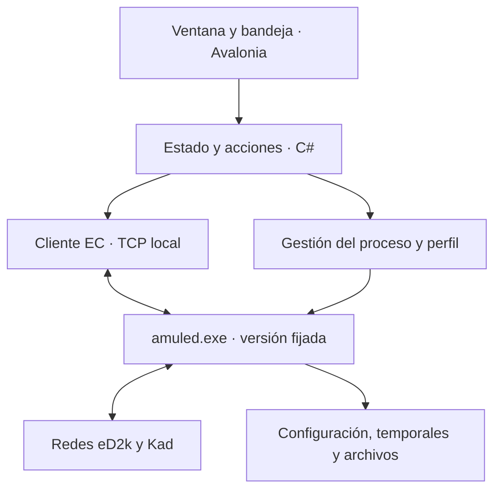

# Aplicación moderna de escritorio sobre aMule

Fecha: 19 de septiembre de 2026. Estado: plan de desarrollo; todavía no se ha ejecutado ni probado el motor en este equipo.

## 1. Resultado que queremos

Una aplicación para Windows que permita buscar, descargar, compartir y gestionar archivos con una interfaz moderna y cómoda. El usuario abre un único acceso directo y trabaja desde nuestra ventana. La aplicación gestiona en segundo plano el motor existente de aMule.

La prioridad es mejorar el uso diario: encontrar archivos, entender el estado de una descarga, actuar sobre varias filas y ajustar lo necesario sin recorrer ventanas antiguas. La versión inicial tendrá español, tema claro/oscuro y densidad de información configurable.

Primera plataforma de entrega: Windows 11 x64. Windows 10 x64 y ARM64 serán objetivos posteriores de validación; Linux y macOS se conservarán como posibilidades arquitectónicas, sin declararlos compatibles hasta probarlos.

## 2. Qué reutilizamos y qué construimos

`amuled.exe` es el motor sin interfaz gráfica: un proceso que permanece ejecutándose y mantiene las transferencias. Acepta parámetros de arranque, pero la herramienta de consola para controlarlo se llama `amulecmd`. Nuestra aplicación hablará directamente con el motor mediante External Connections (EC), un protocolo binario sobre TCP. No será necesario analizar la salida textual de una consola. [Manual oficial](https://amule-org.github.io/docs/manual/interfaces/amuled/) y [protocolo EC](https://amule-org.github.io/docs/developer/ec-protocol).

La API oficial de GitHub consultada hoy señala aMule 3.0.1 como última publicación estable y ofrece el archivo Windows x64. He comprobado en el código de esa etiqueta las operaciones de búsqueda, enlaces, cola de descargas, pausa, reanudación, preferencias y cierre. Esto valida la base del diseño; no sustituye una prueba del ejecutable. [Publicación 3.0.1](https://github.com/amule-org/amule/releases/tag/3.0.1) y [servidor EC de esa versión](https://github.com/amule-org/amule/blob/3.0.1/src/ExternalConn.cpp).

El motor conservará la responsabilidad de conectarse a eD2k/Kad, gestionar fuentes y colas, transferir bloques, comprobar archivos y persistir descargas parciales. Nosotros construiremos presentación, integración con Windows, control del proceso y cliente EC.

Las funciones se validarán contra la etiqueta 3.0.1. La documentación web y la rama principal pueden describir cambios posteriores. Cada capacidad de la interfaz tendrá una operación comprobada en la versión fijada; si no existe, se pospondrá o se explicará su limitación.

## 3. Tecnología propuesta

| Parte | Elección | Motivo |
| --- | --- | --- |
| Lenguaje | C# | Un lenguaje para lógica de escritorio, procesos, sockets asíncronos y pruebas. |
| Plataforma | .NET 10 LTS | Base mantenida; versión del SDK y dependencias fijadas en el proyecto. |
| Interfaz | Avalonia, versión estable compatible fijada al iniciar | Aplicación de escritorio con XAML, estilos, tablas y posibilidad de otros sistemas. |
| Presentación | MVVM ligero y CommunityToolkit.Mvvm | Separar estado y acciones de los controles sin crear capas innecesarias. |
| Tablas | DataGrid abierto de Avalonia | Ordenación, selección múltiple, columnas personalizables y detalles aparte. |
| Comunicación | Cliente EC propio pequeño en C# | Control directo, tipos claros y pruebas del protocolo; sin depender de una biblioteca externa sin validar. |
| Preferencias propias | JSON versionado con escritura atómica | Suficiente para temas, columnas, rutas y opciones de la aplicación. |
| Distribución | Publicación .NET autocontenida para win-x64 | No exigir instalar el SDK ni .NET por separado. |

Microsoft identifica .NET 10 como LTS. Avalonia documenta su integración Win32, temas y bandeja en Windows; DataGrid tiene documentación propia. El framework de Avalonia es MIT, aunque algunas herramientas y controles adicionales tienen condiciones distintas: el plan usa componentes abiertos y no depende de TreeDataGrid comercial. [Política de .NET](https://dotnet.microsoft.com/en-us/platform/support/policy), [Avalonia en Windows](https://docs.avaloniaui.net/docs/platform-specific-guides/windows), [DataGrid](https://docs.avaloniaui.net/docs/how-to/datagrid-how-to) y [licencia del framework](https://docs.avaloniaui.net/tools/faq).

Mi criterio frente a las alternativas: WPF sería razonable si el alcance quedara en Windows; Avalonia encaja mejor con «Windows inicialmente». React con Tauri sería válido si priorizáramos una interfaz web reutilizable, pero aquí prefiero mantener la lógica y el escritorio en C#. C++ quedaría reservado para una necesidad demostrada de cambiar el motor. No planeo modificarlo para la primera versión.

## 4. Arquitectura mínima



Dos procesos principales: nuestra aplicación y `amuled.exe`. El motor se controla por `127.0.0.1`; la comunicación interna no se expondrá a la red. No hace falta servicio de Windows, navegador ni servidor HTTP para esta primera versión.

Estructura prevista del código:

```text
src/
  Desktop/       Ventanas, estilos, bandeja y modelos de presentación
  Core/          Operaciones, estado de sesión y modelos de datos
  Amule/         Transporte EC, codificación y gestión del motor
tests/
  Protocol/      Paquetes, autenticación y tratamiento de errores
  Integration/   Pruebas contra el binario fijado
packaging/       Publicación, manifiestos y motor distribuido
docs/           Decisiones, capacidades verificadas y validación
```

La cola del motor será la fuente de verdad. La aplicación mantendrá una copia para mostrarla, sin crear una segunda cola persistente. Al reconectar, recuperará el estado real.

## 5. Diseño de la experiencia

### Distribución de la ventana

Barra lateral estrecha con Buscar, Descargas, Compartidos, Conexión y Ajustes. Zona central amplia para resultados o transferencias. Panel lateral o inferior desplegable para los detalles del elemento seleccionado. Barra de estado persistente con conexión eD2k/Kad, tasas de transferencia y mensajes accionables.

La pantalla inicial será Descargas. No habrá un panel de bienvenida con grandes tarjetas que quite espacio a las filas. Las acciones frecuentes estarán visibles; las opciones avanzadas quedarán en el menú contextual y el panel de detalles.

### Estilo y comportamiento

- Apariencia sobria: tema del sistema por defecto, variantes clara y oscura, acento único e iconos vectoriales con etiquetas comprensibles.
- Tipografía legible, buen contraste, foco de teclado visible y estados identificados con texto además de color.
- Filas de aproximadamente 32–36 px, con modo compacto posterior si la prueba visual lo justifica.
- Columnas redimensionables y reordenables; guardar ancho, orden, visibilidad y ordenación.
- Conservar selección y desplazamiento durante las actualizaciones.
- Buscar, añadir enlace, pausar y reanudar accesibles por teclado.
- Evitar animaciones continuas; las actualizaciones no deben hacer saltar la tabla.
- Probar escalado al 100 %, 150 % y 200 %, monitores distintos y una ventana de 1280 × 720.

### Buscar

Campo principal, tipo de búsqueda disponible en el motor, filtro de tipo y tamaño. Resultados en tabla con nombre, tamaño, disponibilidad/fuentes y estado de descarga si el motor facilita esos campos. Descargar la selección, copiar enlace y ver detalles.

Primera versión: una búsqueda activa en el motor. Se podrá conservar el texto de búsquedas anteriores; mantener resultados como pestañas no implicará búsquedas simultáneas. Los resultados antiguos se tratarán como instantáneas y solo se podrán usar para descargar si contienen los datos necesarios verificados. La gestión simultánea de varias búsquedas será una capacidad posterior a comprobar.

### Descargas

Filtros por estado y categoría; tabla con nombre, progreso, tamaño, velocidad, fuentes y prioridad. Tiempo restante solo cuando pueda estimarse con sentido, marcado como estimación. Selección múltiple y acciones de pausa/reanudación. Cancelar estará diferenciado de eliminar un archivo completado.

Detalle: ruta, hash, disponibilidad, fuentes y mensajes del motor, según los campos que EC exponga. Los datos no disponibles se mostrarán como tales. No se atribuirá una causa concreta a una espera si el motor no la informa.

### Compartidos

Lista de archivos y directorios compartidos, filtro por nombre y consulta de estadísticas disponibles. La selección de carpetas será explícita y acotada. Abrir carpeta será una acción voluntaria; no se ejecutarán archivos descargados automáticamente.

### Conexión y ajustes

Conexiones de eD2k y Kad, servidor actual, estado HighID/LowID cuando esté disponible y acciones de conectar/desconectar. Explicación breve de cómo afecta la conectividad, sin prometer que un cambio de interfaz mejore las fuentes o el ancho de banda.

Ajustes iniciales: carpetas, límites de subida/bajada, conexiones, comportamiento al cerrar, inicio con Windows opcional, tema e idioma. Aplicar cambios en caliente solo si la versión del motor los admite; los demás indicarán que requieren reinicio ordenado. Editar el archivo del motor únicamente cuando esté detenido.

## 6. Primer arranque y vida del motor

1. Comprobar el binario incluido, su versión, la carpeta de configuración y los permisos de escritura.
2. Pedir las carpetas de descargas y temporales; explicar los directorios que quedarán compartidos.
3. Crear un perfil propio, separado de instalaciones existentes de eMule/aMule.
4. Crear credencial aleatoria EC y restringir el acceso al perfil al usuario de Windows. Proteger la copia que necesite la aplicación con el mecanismo de credenciales de Windows. No pasar secretos por argumentos visibles ni registrarlos.
5. Comprobar que el puerto local elegido está libre. No conectarse ni detener procesos ajenos por coincidencia de nombre o puerto.
6. Iniciar el motor sin consola visible y confirmar, por separado, proceso, escucha TCP y autenticación EC.
7. Permitir conectar a las redes y mostrar el estado real. Una conexión limitada no se etiquetará como fallo de la aplicación.

La X ocultará la ventana en la bandeja y mantendrá las transferencias; se explicará la primera vez. El menú ofrecerá «Salir y detener las transferencias», que solicitará cierre ordenado por EC y esperará la salida. Si tarda, la aplicación mostrará el problema y no matará automáticamente el proceso.

Se evitarán instancias duplicadas mediante exclusión por perfil. Después de un fallo de la interfaz, el siguiente arranque comprobará si el motor propio sigue vivo y se reconectará tras verificar identidad y autenticación. Una segunda ejecución llevará la ventana existente al frente y le pasará el enlace solicitado.

## 7. Cliente EC y límites de compatibilidad

El trabajo con más incertidumbre es el adaptador EC. Es binario y requiere tratar correctamente cabeceras, tamaños, etiquetas, tipos, autenticación y lecturas parciales de TCP. Se fijará la versión de protocolo que acepte el binario probado.

Primera implementación: autenticación y solicitudes/respuestas secuenciales. Solo anunciar capacidades implementadas y ensayadas. Límites de tamaño y profundidad, tiempos máximos y cancelación para evitar bloqueos o asignaciones descontroladas. Una operación que modifica estado no se repetirá a ciegas tras un corte; se consultará primero el estado resultante.

Actualizar descargas y estadísticas aproximadamente cada segundo mientras estén visibles. Reducir consultas en bandeja y consultar compartidos bajo demanda. Estos son valores iniciales a ajustar mediante medición. Evitar recorridos completos de listas grandes en cada ciclo; usar actualizaciones incrementales cuando se hayan contrastado con la versión concreta.

Cada conexión nueva reconstruirá su estado. Identificadores internos que puedan cambiar entre sesiones no se guardarán como identidades permanentes; se usarán hashes donde corresponda y se resolverán los identificadores actuales.

Matriz de capacidades a completar durante el desarrollo:

| Función | Evidencia existente | Validación pendiente |
| --- | --- | --- |
| Autenticación y estado | Protocolo oficial | Conexión real con 3.0.1 Windows |
| Enlaces, cola, pausa y reanudación | Operaciones en el código 3.0.1 | Descargar, pausar y reanudar realmente |
| Búsquedas y resultados | Operaciones en el código 3.0.1 | eD2k/Kad y semántica de una búsqueda activa |
| Preferencias | Operaciones en el código 3.0.1 | Campos modificables y necesidades de reinicio |
| Cierre del motor | Operación en el código 3.0.1 | Persistencia y salida limpia en Windows |
| Fuentes y estadísticas detalladas | Dependen de etiquetas y nivel solicitado | Alcance exacto y coste de las consultas |

## 8. Datos, empaquetado y mantenimiento

Configuración normal bajo `%LOCALAPPDATA%\<NombreApp>`, con subdirectorios separados para UI, motor y registros. Las descargas estarán en la carpeta elegida. Si se ofrece modo verdaderamente portable, será explícito: datos junto al ejecutable en una carpeta escribible; no confundir un ZIP sin instalador con portabilidad completa del perfil.

Primera entrega técnica en ZIP autocontenido; entrega final también con instalador por usuario y acceso directo. Incluir dependencias del motor comprobadas, manifiesto de versiones y hashes, licencias y material de código fuente correspondiente para la distribución. El código de aMule declara GPL v2 o posterior. La licencia de la aplicación nueva se fijará de forma compatible con el código que efectivamente se reutilice antes de distribuirla. [Licencia aMule](https://github.com/amule-org/amule/blob/3.0.1/LICENSE.md) y [publicación autocontenida .NET](https://learn.microsoft.com/en-us/dotnet/core/deploying/).

La firma del instalador no está incluida en esta estimación: requiere disponer de certificado o servicio de firma. Los primeros artefactos pueden ser locales sin firma, indicando su estado. No se comprará ningún servicio dentro de este plan.

Asociación `ed2k://` opcional y reversible, conservando la asociación previa cuando sea posible. No reemplazar automáticamente la de otro cliente. Inicio con Windows desactivado inicialmente. Las actualizaciones del motor serán explícitas, con copia del perfil y prueba de compatibilidad; no sustituir el motor mientras existan transferencias activas. Una restauración deberá considerar tanto el ejecutable como la versión del perfil.

Registros con rotación y datos sensibles ocultos. Diagnóstico local exportable para soporte. La desinstalación preservará descargas y datos del usuario salvo una acción separada y expresa.

## 9. Fases con entregables y criterios de salida

Las sesiones son bloques orientativos de 1–2 horas de desarrollo y comprobación. No representan ventanas de cuota de Codex ni garantizan una duración concreta.

| Fase | Trabajo | Resultado comprobable | Sesiones orientativas |
| --- | --- | --- | --- |
| 0. Prueba del motor | Paquete oficial fijado, perfil aislado, arranque, conexión EC, enlace, pausa/reanudación y cierre. Usar amulecmd como referencia de diagnóstico. | Descargar un archivo de prueba autorizado, comprobar integridad y recuperar una descarga parcial tras reinicio. | 1–2 |
| 1. Diseño de uso | Ventana, navegación, tabla de descargas y búsqueda; probar densidad, escala y temas con datos sintéticos identificados. | Prototipo navegable que permita evaluar el aspecto y los flujos principales. | 1–2 |
| 2. Adaptador EC | Codificador, decodificador, autenticación, modelos, errores, reconexión y matriz de capacidades. | Pruebas del protocolo y operaciones reales contrastadas con las herramientas oficiales. | 2–4 |
| 3. Primera aplicación útil | Conectar la UI a búsquedas, enlaces, descargas, selección múltiple, filtros y detalle básico. | Buscar → descargar → pausar → reanudar → completar → abrir carpeta desde nuestra aplicación. | 3–5 |
| 4. Uso cotidiano | Compartidos, conexión, límites, categorías verificadas, bandeja, ajustes persistentes y ciclo del proceso. | Cerrar ventana sin perder transferencias y salir completamente sin dejar el motor propio abandonado. | 2–3 |
| 5. Robustez y rendimiento | Cortes, suspensión/reanudación, puerto ocupado, rutas no válidas, colas grandes, perfiles y escalado. | Pruebas reproducibles y sesión prolongada sin corrupción, duplicados ni bloqueos conocidos. | 2–4 |
| 6. Distribución | ZIP, instalador por usuario, licencias, documentos, restauración y pruebas en entorno limpio. | Instalar, ejecutar y desinstalar sin SDK y preservando descargas. | 2–4 |

Total de trabajo base: 13–24 sesiones. Reserva de planificación: aproximadamente 20–25 % por compatibilidad, errores y pulido visual. Presupuesto razonable inicial: unas 16–30 sesiones hasta una versión cuidada para uso diario. Las pruebas prolongadas añaden tiempo de calendario, no necesariamente sesiones activas.

La primera aplicación útil llega al terminar la fase 3, aproximadamente 7–13 sesiones bajo estas hipótesis. Las fases 0 y 2 son puntos de revisión del presupuesto: si la compatibilidad falla, se ajusta el alcance antes de seguir ampliando pantallas.

No se mantiene como presupuesto firme la cifra anterior de tokens: se dio antes de inspeccionar la versión y no es una medida. Registrar el consumo observado por hito, cuando esté disponible, y reestimar después de la prueba del motor y del adaptador. Mantener documentos cortos de estado y tareas concretas para reducir lectura repetida de todo el repositorio.

## 10. Pruebas que determinan que funciona

- Protocolo: paquetes válidos y truncados, tamaños incoherentes, etiquetas desconocidas, lecturas TCP fragmentadas, contraseña incorrecta y desconexiones.
- Integración real: comparar los mismos estados con amulecmd o amulegui, con acciones de referencia controladas para no interferir con las búsquedas.
- Transferencia real de un archivo conocido y autorizado, con checksum independiente. Las pruebas sintéticas no demostrarán funcionamiento P2P.
- Persistencia: reiniciar a mitad de transferencia y confirmar que conserva el progreso; cerrar/reabrir interfaz sin duplicar descargas.
- Errores: falta de permisos, disco insuficiente simulado de forma aislada, enlaces mal formados, carpeta desaparecida y puerto ocupado.
- Windows: bloqueo de sesión, suspensión/reanudación, bandeja, segundo arranque, escalado y carpeta con espacios y caracteres Unicode.
- Tablas: 1.000 transferencias y 10.000 resultados simulados para evaluar desplazamiento, selección y filtros. Separar esta prueba de presentación de la capacidad real del motor.
- Sesión de uso de 8–24 horas y revisión de registros. No extrapolar estabilidad indefinida de esa muestra.

Objetivos de rendimiento, a medir y ajustar: respuesta a acciones locales normalmente inferior a 200 ms; cambios del motor reflejados normalmente en 1–2 segundos con la ventana visible; interfaz inactiva con consumo de CPU cercano a cero. Registrar RAM/CPU de la interfaz y del motor por separado, con número de filas, archivos compartidos y actividad de hashing. No se promete todavía una cifra de RAM ni de velocidad de descarga.

## 11. Alcance de la primera versión y ampliaciones

La primera versión incluirá todo el flujo cotidiano de búsqueda y transferencia, ajustes básicos, carpetas compartidas, conexión, bandeja y distribución para Windows x64.

Quedan para iteraciones posteriores: motor remoto en VM/NAS, otras plataformas, búsquedas simultáneas si el motor elegido las soporta, migración de archivos parciales de otros clientes, estadísticas históricas avanzadas, plugins y modificaciones del protocolo P2P. El adaptador EC mantendrá estas opciones abiertas sin implementarlas anticipadamente.

No se copiarán perfiles existentes ni se asociarán sus directorios temporales al nuevo motor. Una futura migración tendrá inventario, copia y prueba propios. La convivencia inicial se hará con perfiles y puertos distintos cuando haya otro cliente en ejecución.

## 12. Primer trabajo al comenzar la implementación

Crear repositorio y registrar este plan; comprobar herramientas disponibles sin instalar versiones arbitrarias; obtener el paquete oficial fijado y su código de referencia; preparar un perfil aislado y realizar la fase 0. Entregar su informe con versión, autenticación, operaciones probadas, descarga real, integridad y cierre. A continuación, construir la pantalla de Descargas para validar pronto el cambio visual que motiva el proyecto.

## 13. Estado documental

Este documento contiene decisiones propuestas y verificaciones documentales realizadas el 19/09/2026. No se ha instalado ni ejecutado aMule como parte de la planificación.

La consulta a TDKop `joplin_status` devolvió conexión rechazada por Web Clipper en `127.0.0.1:41184`. La copia a la libreta Codex queda pendiente; no se ha utilizado joplin-bridge ni se ha accedido a SQLite para esta escritura.

Actualización 20/09/2026: 0.2.0-dev completó Descargas y Servidores. 0.3.0-dev añade búsqueda eD2k y descarga desde resultados. El estado ejecutado y sus límites están en STATUS.md; el texto anterior conserva la planificación original.
